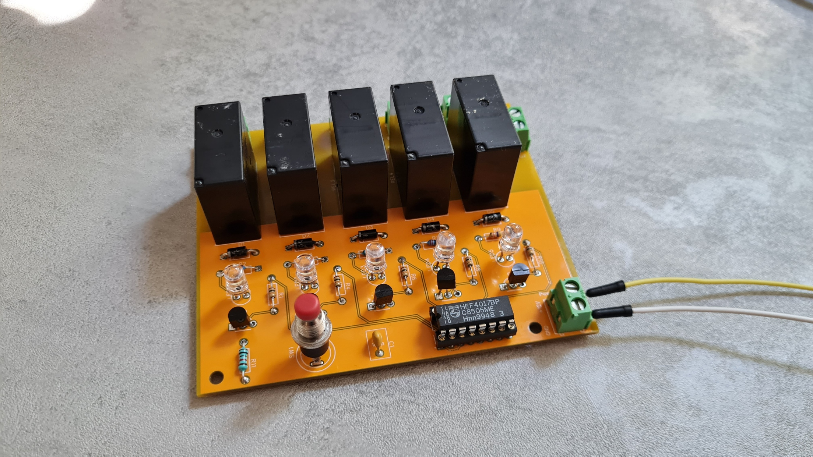
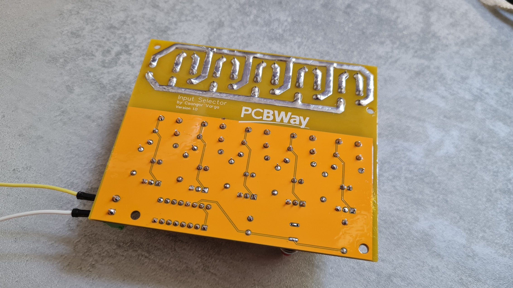
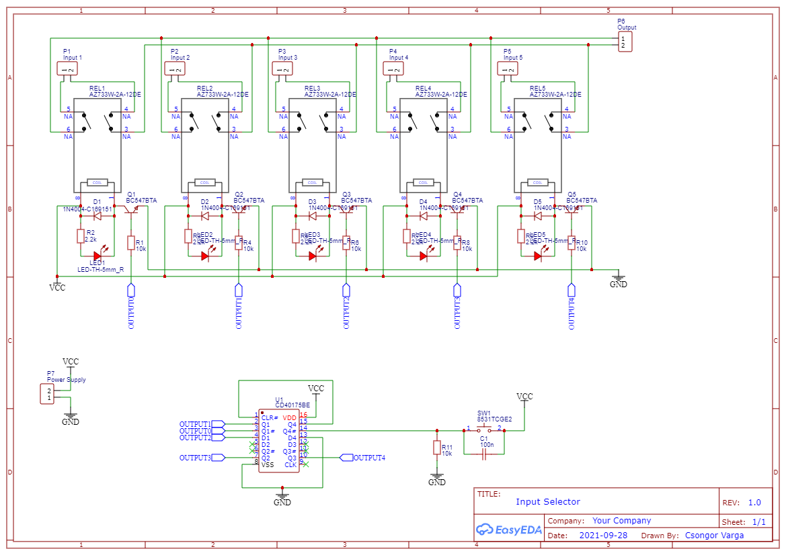

# DC Input Selector
I am using this board to pre-select power supply for me garden layout. I primarily use Marklin Digital, but sometimes I also have guest trains running on DC power, also external digital station. One of the 5 inputs will be reouted to the output connection.

Please note:
- I run this board from 12V, but if you pick different relays you can use lower voltage as well. In that case you need to check the resistors
- There is no polarity protection on the supply input terminal, please double check your connections
- In the schematics, I included 2.2K resistor for the LED, but actually for the LED I picked (random LED from my parts bin), I ended up using a 5K resistor.

